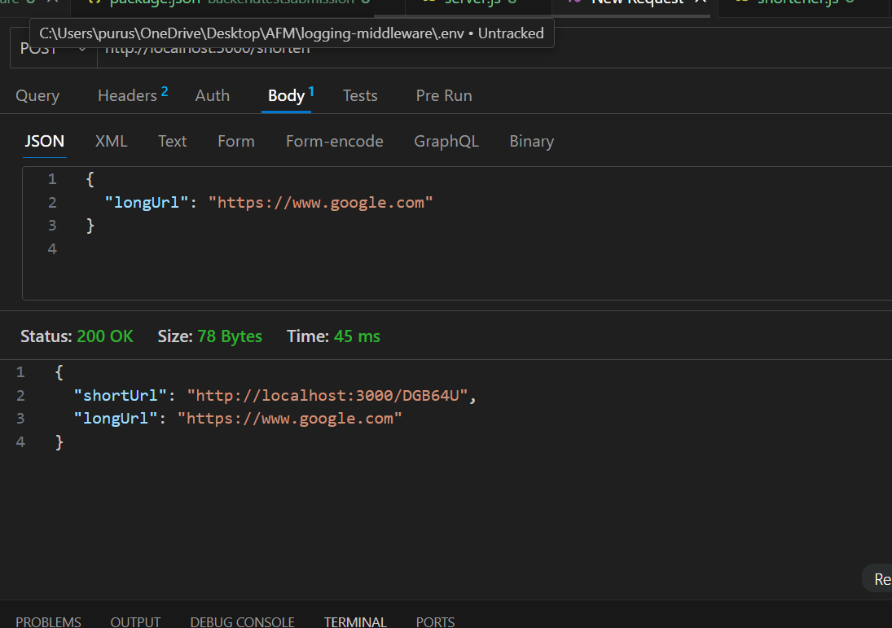

# URL Shortener & Logging Middleware – System Design Document

## Introduction
This project is a simple **URL Shortener** service along with a **Logging Middleware**.  
The goal was to build a clean, working backend that is easy to test and extend.

---

## Key Design Choices
- **Node.js + Express.js** → lightweight and suitable for quick API development.  
- **Nanoid** → used to generate short unique IDs for URLs.  
- **In-memory storage (JavaScript Map)** → chosen for this assignment. Can be replaced with a database in production.  
- **Logging Middleware** → captures log details (`stack`, `level`, `package`, `message`) for debugging and tracking.  

---

## Data Model
### URL Shortener
Stores mapping between `shortUrl` and `longUrl`.

Example:
```json
{
  "shortUrl": "http://localhost:3000/abc123",
  "longUrl": "https://www.google.com"
}
# AFM Project


